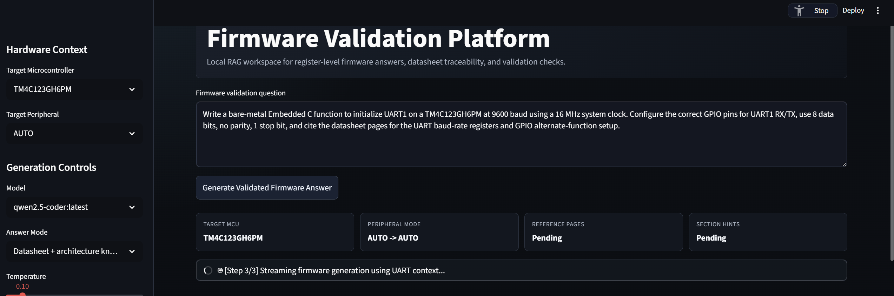
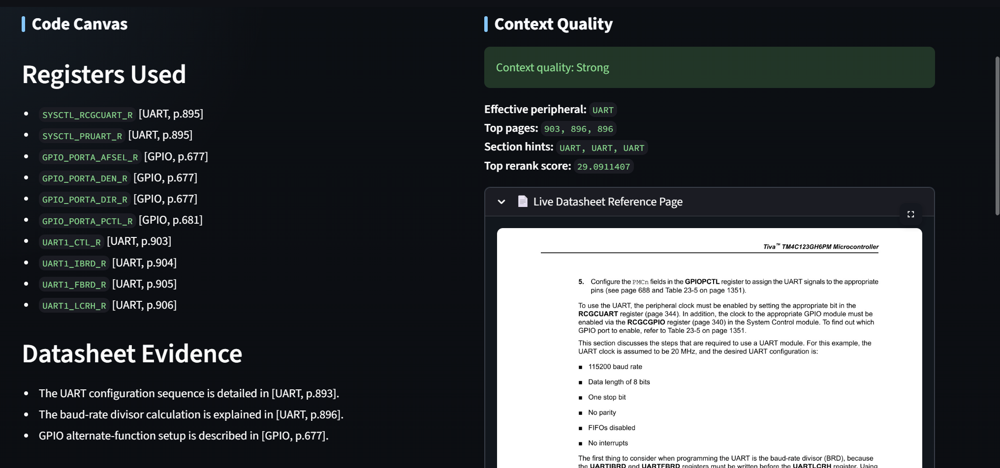
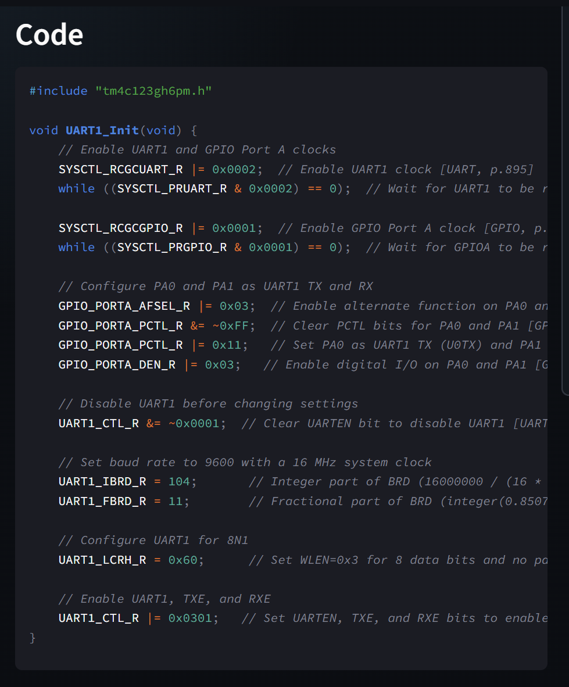
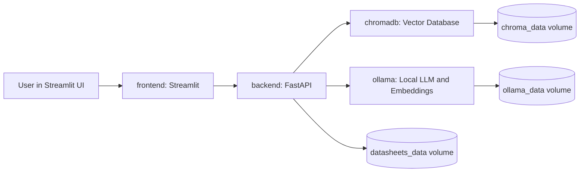

# embedded-copilot-rag

Local, Docker-based RAG platform for embedded firmware assistance. The system ingests MCU datasheets, stores semantic chunks in ChromaDB, retrieves peripheral-specific context, streams answers from a local Ollama model, and validates generated register-level C with traceable datasheet evidence.

## Screenshots

### Firmware Validation Workspace

The main Streamlit workspace includes hardware context controls, model controls, the firmware prompt, live generation status, and retrieval summary cards.



### Context Quality And Live Datasheet Reference

The platform retrieves relevant datasheet chunks, reports context quality, and displays the top matching PDF page beside the generated answer.



### Generated Bare-Metal Code

The Code Canvas streams register-level C output with citations and deterministic values such as UART baud divisors.



## Current Project Status

This project has progressed through the following phases:

1. Infrastructure scaffolding with FastAPI, Streamlit, and Docker Compose.
2. Local offline LLM integration with Ollama.
3. PDF datasheet upload, text extraction, and chunking.
4. ChromaDB vector storage with Ollama embeddings.
5. Full RAG loop with context retrieval and generated firmware answers.
6. Firmware validation UX with streaming responses, page previews, context diagnostics, register hallucination checks, static C checks, and index management.

## Architecture



## Services

The application runs four containers on the shared `embedded-ai-network` bridge network.

| Service | Container | Purpose | Port |
| --- | --- | --- | --- |
| `frontend` | `embedded-ai-frontend` | Streamlit UI | `8501:8501` |
| `backend` | `embedded-ai-backend` | FastAPI API, RAG orchestration, validation | `8000:8000` |
| `ollama` | `embedded-ai-ollama` | Local generation and embedding models | `11434:11434` |
| `chromadb` | `embedded-ai-chromadb` | Vector database | `8001:8000` |

The Ollama service is configured with an NVIDIA GPU reservation in `docker-compose.yml`.

## Folder Structure

```text
embedded-copilot-rag/
  docker-compose.yml
  README.md
  backend/
    Dockerfile
    main.py
    parser.py
    requirements.txt
    vector_store.py
  frontend/
    Dockerfile
    app.py
    requirements.txt
  docs/
    images/
      firmware-validation-workspace.png
      context-quality-reference.png
      generated-uart-code.png
```

## Data Volumes

| Volume | Mounted In | Purpose |
| --- | --- | --- |
| `datasheets_data` | `/app/datasheets` in backend | Stores uploaded PDF datasheets so page rendering survives container rebuilds |
| `chroma_data` | `/data` in ChromaDB | Stores vector index data |
| `ollama_data` | `/root/.ollama` in Ollama | Stores downloaded Ollama models |

Because these are Docker volumes, rebuilding the backend or frontend does not require reuploading the PDF or redownloading models.

## Backend

The backend is a FastAPI application in `backend/main.py`.

Main responsibilities:

- Accept PDF uploads.
- Extract PDF text page by page.
- Chunk text while preserving metadata.
- Store embeddings in ChromaDB.
- Query ChromaDB by MCU and rerank by inferred peripheral.
- Stream RAG answers from Ollama using Server-Sent Events.
- Render PDF reference pages as PNG images.
- Run hallucination and static C checks on generated code.

### Backend Endpoints

| Method | Endpoint | Purpose |
| --- | --- | --- |
| `GET` | `/health` | Basic backend health check |
| `POST` | `/upload` | Upload, parse, chunk, embed, and index a PDF |
| `POST` | `/chat` | Streaming RAG firmware answer endpoint |
| `GET` | `/page-image` | Render a stored PDF page as PNG |
| `GET` | `/index/datasheets` | List indexed datasheets |
| `DELETE` | `/index/datasheets` | Delete a datasheet's Chroma index entries |
| `GET` | `/index/sections` | Show chunk counts by detected section |
| `POST` | `/index/reindex` | Rebuild vector index for a saved PDF |

### PDF Parsing

`backend/parser.py` extracts text page by page using `pypdf`. Each chunk keeps the source file name, page number, section hint, section title, subsection title, and raw text so answers can be traced back to the datasheet.

### Vector Store

`backend/vector_store.py` connects to ChromaDB and stores embedded chunks in the `mcu_datasheets` collection. Embeddings are generated by Ollama with `nomic-embed-text`.

The current strategy is:

- Store each PDF once under the selected MCU.
- Store `peripheral=ALL`.
- Attach a `section_hint` to each chunk.
- Query by MCU.
- Rerank by selected or auto-detected peripheral terms.
- Prefer chunks where `section_hint` matches the effective peripheral.

## Frontend

The frontend is a Streamlit app in `frontend/app.py`.

Main UI areas:

- Hardware context sidebar.
- Model and generation controls.
- Datasheet upload and index management.
- Firmware prompt input.
- Code Canvas.
- Context Quality panel.
- Live Datasheet Reference Page viewer.
- Vector trace diagnostics.
- Hallucination Guard and C Static Checks.

## Running The Project

From the project root:

```powershell
docker-compose up -d --build
```

Open the Streamlit UI:

```text
http://localhost:8501
```

Backend health endpoint:

```text
http://localhost:8000/health
```

## Useful Docker Commands

Show running services:

```powershell
docker-compose ps
```

Follow backend logs:

```powershell
docker logs -f embedded-ai-backend
```

Rebuild only backend and frontend:

```powershell
docker-compose up -d --build backend frontend
```

Stop all services:

```powershell
docker-compose down
```

Remove persistent volumes only if you intentionally want to wipe indexed data and models:

```powershell
docker-compose down -v
```

## Model Setup

The app expects these Ollama models to be available:

```text
qwen2.5-coder:latest
nomic-embed-text
```

Pull them with:

```powershell
docker exec -it embedded-ai-ollama ollama pull qwen2.5-coder:latest
docker exec -it embedded-ai-ollama ollama pull nomic-embed-text
```

## Typical Workflow

1. Start the stack with Docker Compose.
2. Open `http://localhost:8501`.
3. Upload a PDF datasheet in the sidebar.
4. Process the datasheet.
5. Use "List indexed datasheets" to confirm it is indexed.
6. Ask a firmware question.
7. Leave Target Peripheral on `AUTO` unless you want to force retrieval.
8. Review the generated answer, reference page, context quality, hallucination guard, static checks, and vector trace diagnostics.

## Reuploading vs Reindexing

You do not need to reupload the PDF after a page refresh or a backend/frontend rebuild.

Use "Reindex datasheet" when chunking logic, section detection, embedding metadata, or retrieval behavior changes.

Use "Delete datasheet index" when the index is stale, the wrong MCU was indexed, or you want to remove a datasheet from retrieval.

