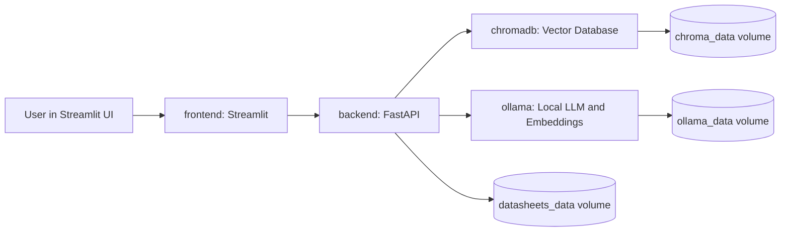

# embedded-copilot-rag


Local, Docker-based RAG platform for embedded firmware assistance. The system ingests MCU datasheets, stores semantic chunks in ChromaDB, retrieves peripheral-specific context, streams answers from a local Ollama model, and validates generated register-level C with traceable datasheet evidence.

## Current Project Status

This project has progressed through the following phases:

1. Infrastructure scaffolding with FastAPI, Streamlit, and Docker Compose.
2. Local offline LLM integration with Ollama.
3. PDF datasheet upload, text extraction, and chunking.
4. ChromaDB vector storage with Ollama embeddings.
5. Full RAG loop with context retrieval and generated firmware answers.
6. Firmware validation UX with streaming responses, page previews, context diagnostics, register hallucination checks, static C checks, and index management.

## Architecture



## Services

The application runs four containers on the shared `embedded-ai-network` bridge network.

| Service | Container | Purpose | Port |
| --- | --- | --- | --- |
| `frontend` | `embedded-ai-frontend` | Streamlit UI | `8501:8501` |
| `backend` | `embedded-ai-backend` | FastAPI API, RAG orchestration, validation | `8000:8000` |
| `ollama` | `embedded-ai-ollama` | Local generation and embedding models | `11434:11434` |
| `chromadb` | `embedded-ai-chromadb` | Vector database | `8001:8000` |

The Ollama service is configured with an NVIDIA GPU reservation in `docker-compose.yml`.

## Folder Structure

```text
embedded-copilot-rag/
  docker-compose.yml
  README.md
  backend/
    Dockerfile
    main.py
    parser.py
    requirements.txt
    vector_store.py
  frontend/
    Dockerfile
    app.py
    requirements.txt
```

## Data Volumes

| Volume | Mounted In | Purpose |
| --- | --- | --- |
| `datasheets_data` | `/app/datasheets` in backend | Stores uploaded PDF datasheets so page rendering survives container rebuilds |
| `chroma_data` | `/data` in ChromaDB | Stores vector index data |
| `ollama_data` | `/root/.ollama` in Ollama | Stores downloaded Ollama models |

Because these are Docker volumes, rebuilding the backend or frontend does not require reuploading the PDF or redownloading models.

## Backend

The backend is a FastAPI application in `backend/main.py`.

Main responsibilities:

- Accept PDF uploads.
- Extract PDF text page by page.
- Chunk text while preserving metadata.
- Store embeddings in ChromaDB.
- Query ChromaDB by MCU and rerank by inferred peripheral.
- Stream RAG answers from Ollama using Server-Sent Events.
- Render PDF reference pages as PNG images.
- Run hallucination and static C checks on generated code.

### Backend Endpoints

| Method | Endpoint | Purpose |
| --- | --- | --- |
| `GET` | `/health` | Basic backend health check |
| `POST` | `/upload` | Upload, parse, chunk, embed, and index a PDF |
| `POST` | `/chat` | Streaming RAG firmware answer endpoint |
| `GET` | `/page-image` | Render a stored PDF page as PNG |
| `GET` | `/index/datasheets` | List indexed datasheets |
| `DELETE` | `/index/datasheets` | Delete a datasheet's Chroma index entries |
| `GET` | `/index/sections` | Show chunk counts by detected section |
| `POST` | `/index/reindex` | Rebuild vector index for a saved PDF |

### PDF Parsing

`backend/parser.py` extracts text page by page using `pypdf`.
